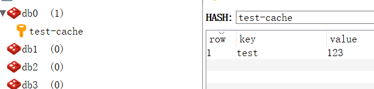
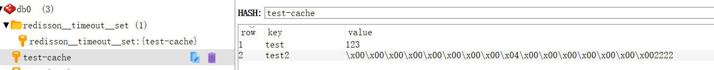
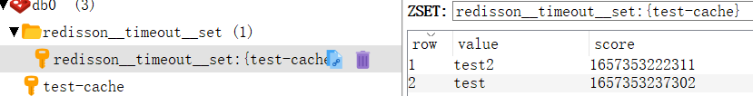

# RedissonCachedMap 

## Local Cache 本地缓存功能

> 直接对应redis hash

```
LocalCachedMapOptions options = LocalCachedMapOptions
    .defaults()
    .timeToLive(10, TimeUnit.SECONDS)
    .maxIdle(5, TimeUnit.SECONDS)
    .cacheSize(1000)
    .evictionPolicy(LocalCachedMapOptions.EvictionPolicy.LRU)
    .reconnectionStrategy(LocalCachedMapOptions.ReconnectionStrategy.CLEAR)
    .syncStrategy(LocalCachedMapOptions.SyncStrategy.INVALIDATE);
    RLocalCachedMap<String, Long> localCachedMap = redisson.getLocalCachedMap("test-cache", LongCodec.INSTANCE, options);

```
.
### EvictionPolicy 本地缓存清理策略

> 不清理: NONE(默认) 

> 淘汰算法: LFU, LRU

> 利用不同引用的GC特性: SOFT, WEAK

### ReconnectionStrategy 断线重连策略

> CLEAR 重连之后清理本地缓存

> LOAD 保留作废表 10分钟内恢复连接则清理作废表内的 10分钟以外则全部干掉

> NONE 不清理(默认)

## SyncStrategy 本地缓存同步策略

> INVALIDATE 清理(默认) 本地缓存更新的时候 广播此条消息,清除所有相同缓存条目

> UPDATE 更新 广播更新本地缓存

> NONE 

# RMapCache 带过期策略的map缓存

> 数据存储: 数据采用hash存储 

> 过期时间存储: 采用zset存储 在 redisson__timeout__set:{key} 
> 用过期时间戳作为score去进行zset排序这样在进行过期检查的时候就可以优先检查要过期的内容

```java
    MapOptions options = MapOptions.defaults()
        .writeMode(MapOptions.WriteMode.WRITE_BEHIND);
    RMapCache<String, Long> cache = redisson.getMapCache("test-cache", LongCodec.INSTANCE, options);
    cache.put("test", 1111L, 1, TimeUnit.MINUTES);
    cache.put("test2", 2222L, 45, TimeUnit.SECONDS);
```
> 数据

> 过期时间戳


## MapCacheEvictionTask 过期检查实现原理

> 

## 布隆过滤器

> k 为哈希函数个数，m 为布隆过滤器长度，n 为插入的元素个数，p 为误报率
>