# Redisson

## 分享内容概述

- redisson是redis java api的一种实现,同时也提供了很多功能扩展和封装好的工具,如:本地缓存,容器内数据单独指定过期时间,布隆过滤器,限流器,分布式锁等.
- 本次分享主要集中在映射,集合,分布式锁三块,了解redisson的特性
- 以RedissonMapCache的实现原理分析redisson数据淘汰机制实现方法
- 分析分布式锁和自动续签机制的实现原理

## 映射

### RMap,常用实现类:RedissonMap

1. 无元素淘汰功能,无本地缓存功能 相当于原生的redis hash,
2. RedissonMap通过实现ConcurrentMap接口提供了一套易于上手的API 使用的时候可以将其当做数据存储在redis上的远程对象
3. 在操作过成功中还需要考虑减少不必要的数据传输开销,如使用fastPut代替put操作(fastPut返回true表示新增 false 表示修改)
4. 还可以使用loader,writer来进行数据的持久化; 
    - 在写入模式为同步时先写writer,再写Redis,异步模式下会先写Redis 再异步写入(官方文档称可以用writeBehindThreads控制线程数,但是全局搜索没有发现这个参数 可能是Pro版才支持)
    - loader在查询时如果得到的是null,会从loader获取数据,调用loadAll会将loader中获取的数据写入redis;loadAll 的replace传入如果为true,loader中的数据与redis不一致时会用loader的数据覆盖Redis中的数据
5. 配置参数和使用示例
```java
// 这里用hashmap代表外部的持久化方式
Map<String, Object> outStorage = new ConcurrentHashMap<>();
MapOptions<String, Object> options = MapOptions.<String, Object>defaults()
    // 同步写入模式
    .writeMode(MapOptions.WriteMode.WRITE_THROUGH)
    // 这两项是异步写入的参数 分别是延迟写入的等待时长和每次批量写入的条数
// .writeBehindDelay(500)
// .writeBehindBatchSize(100)
    // loader
    .loader(new MapLoader<String, Object>() {
        // load all首先需要知道loader有哪些数据
        @Override
        public Iterable<String> loadAllKeys() {
            // 读取keys 可以返回一个迭代器的实现使用时逐个获取 这里直接返回set
            return outStorage.keySet();
        }
        // 根据key从loader获取数据
        @Override
        public Object load(String key) {
            // 从持久化数据中读取
            return outStorage.get(key);
        }
    })
    // writer
    .writer(new MapWriter<String, Object>() {

        @Override
        public void write(Map<String, Object> map) {
            // 持久化 
            outStorage.putAll(map);
        }

        @Override
        public void delete(Collection<String> keys) {
            // 操作
            outStorage.keySet().removeAll(keys);
        }
    });
RMap<String, Object> map = redisson.getMapCache("test-cache", StringCodec.INSTANCE, options);
map.put("test", "value");
map.put("test2", "value2");
map.put("test3", "value3");
assertEquals("value", outStorage.get("test"));
// 注意 test2从外部存储移除了
outStorage.remove("test2"); 
assertEquals("value2", map.get("test2"));
// 从redis删 writer会把外部存储的也删了
map.remove("test");
assertNull(outStorage.get("test"));
// 这里只是改了外部存储 redis不会自动同步
outStorage.put("test3", "modify-3");
// 写入redis 也会被writer写入外部存储
outStorage.put("test4", "value4");
// 将外部的全部key存到redis 传false 如果redis存在key相同 value不相同的不会被修改
// 如果是数据库做外部数据源 使用loadAll必须十分谨慎 最好传keys
map.loadAll(false, 1);
outStorage.put("notExistsInRedis", "value");
// 即使外部存储修改了 replace=false, redis数据依旧不会被覆盖
assertEquals("value3", map.get("test3"));
//虽然redis没有 但是外部存储有 可以走loader拿到
assertEquals("value", map.get("notExistsInRedis"));
// 这里说明loadAll的过程中将test4加入到了缓存
outStorage.remove("test4");
assertEquals("value4", map.get("test4"));
// replace传true 的情况下 相同key的数据会使用外部存储数据覆盖Redis
outStorage.put("test5", "value5");
map.loadAll(true, 1);
assertEquals("modify-3", map.get("test3"));
assertEquals("value5", map.get("test5"));
// 不管是true传false 外部存储新增的load的时候都会写到redis
```
6. 使用场景,与redis hash一致, 需要考虑大key和问题

### RLocalCachedMap 常用实现类:RedissonLocalCachedMap

1. RLocalCachedMap在RedissonMap的基础上增加了本地缓存功能,如果数据被访问的频率非常高以至于redis的压力很大,可以考虑引入本地缓存降低redis的压力
2. 就如同在仅有数据库的系统中引入Redis需要考虑数据一致性问题一样 再引入一级缓存也需要考虑这个问题
3. RedissonLocalCachedMap的本地缓默认是自定义实现的,也可以使用caffeine,使用caffeine的实现时无需指定LRU/LFU淘汰算法(caffein有一结合LRU和LFU特点的W-TinyLFU淘汰算法),但依旧可以使用软引用,弱引用的方式进行清理(是否需要考虑内存泄露的问题需要看caffeine源码)
4. 使用注意事项: 即使是相同的key 对应的cache也不会是同一份缓存 甚至同一个hash key对应的value 都不是对应的同一个对象(各自序反列化的) 每一个 RedissonLocalCachedMap 都会持缓存一个对象(它们是不同的副本) 所以需要特别注意用完destroy问题和缓存的内存占用问题
5. 基本操作和内存问题验证的代码示例
```java
//构造方法是protected的 使用defaults来创建
LocalCachedMapOptions<String, Long> options = LocalCachedMapOptions.<String, Long>defaults()
    //本地缓存存活时长
    .timeToLive(10, TimeUnit.SECONDS)
    // 最大空闲时长
    .maxIdle(5, TimeUnit.SECONDS)
    // 本地缓存容量
    .cacheSize(1000)
    // 使用默认实现
    .cacheProvider(LocalCachedMapOptions.CacheProvider.REDISSON)
    // 存储方式 仅本地缓存/本地+redis (默认本地+redis)
    .storeMode(LocalCachedMapOptions.StoreMode.LOCALCACHE_REDIS)
    // 淘汰策略 LRU,LFU算法及由jvm管理的软引用,弱引用 和不淘汰
    .evictionPolicy(LocalCachedMapOptions.EvictionPolicy.LRU)
    // 断线重连之后动作
    // NONE 无操作(默认)
    // CLEAR 清空本地缓存 个人认为用CLEAR会比较好
    // Load (保存10分钟 如果10分钟内重连成功则清除失效的hash条目 10分钟以上本地缓存全部清除)
    .reconnectionStrategy(LocalCachedMapOptions.ReconnectionStrategy.CLEAR)
    // 缓存同步策略
    // INVALIDATE redis内的数据变更时 删本地缓存(默认)
    // UPDATE 更新本地缓存
    // NONE 无操作
    .syncStrategy(LocalCachedMapOptions.SyncStrategy.INVALIDATE);
RedissonLocalCachedMap<String, Long> localCachedMap = (RedissonLocalCachedMap<String, Long>) redisson
    .getLocalCachedMap("test-local", LongCodec.INSTANCE, options);
//使用-128-127以外的数据 防止基本类型的常量池导致判断对象是不是同一个的结果不准确
localCachedMap.put("test", Long.MAX_VALUE);
// 看看相同的设置能不能使用同一个本地缓存
RedissonLocalCachedMap<String, Long> localCachedMap2 = (RedissonLocalCachedMap<String, Long>) redisson
    .getLocalCachedMap("test-local", LongCodec.INSTANCE, options);
// 带有本地缓存的 
localCachedMap2.get("test");
localCachedMap.get("test");
// 判断cache中缓存的是不是同一个对象 (这个方法是自己加的 只从cache get数据)
CacheValue cachedValue1 = localCachedMap.getCacheObject("test");
CacheValue cachedValue2 = localCachedMap2.getCacheObject("test");
//注意 这两个Long 仅仅是值相同 不是同一个对象 说明多个RedissonLocalCachedMap没有共用相同的本地缓存 甚至不能共享相同的对象
assertEquals(cachedValue1.getValue(), cachedValue2.getValue());
assertFalse(cachedValue1.getValue() == cachedValue2.getValue());
localCachedMap.destroy();
localCachedMap2.destroy();
```
6. 适用场景: 写少读多,高频读取场景,但是还要并发情况下创建多个实例的带来的内存开销问题(考虑单例)

### RMapCache

1. Redis自身并不支持对Hash中的单个元素指定过期时间进行淘汰 而RMapCache 在RMap的基础上通过额外存储hash的过期时间,空闲时间,最近访问时间,最近访问次数实现了元素的定期淘汰功能
2. RMapCache的辅助数据存储结构
* redisson__idle__set:{key-name} 用zset存储的hash key和时间戳 超过时间后key被视为长期未使用等待被淘汰
* redisson__map_cache__last_access__set:{key-name} 用zset存储的元素访问信息 LRU记录访问时间戳 LFU记录访问次数
* redisson__timeout__set:{test-key1} key的过期时间 
* {key-name}:redisson_options map的配置信息
3. 元素get和RMap相同,只进行hget和loader相关操作;
4. 元素put过程需要进行key的过期检测,超过容量的情况下进行淘汰
* 补充流程图
5. 定时任务对元素进行定期淘汰
* 补充流程图
6. RMapCache在元素变动时通过publish机制发布 支持通过listener对元素变动进行监听
    * 代码示例
 ```java
Map<String, String> ourStorage = new HashMap<>();
MapOptions<String, String> options = MapOptions.<String, String>defaults()
    .writeMode(MapOptions.WriteMode.WRITE_THROUGH)
    .loader(new MapLoader<String, String>() {
        @Override
        public String load(String key) {
            return ourStorage.get(key);
        }

        @Override
        public Iterable<String> loadAllKeys() {
            return ourStorage.keySet();
        }
    })
    .writer(new MapWriter<String, String>() {
        @Override
        public void write(Map<String, String> map) {
            // 这里可以用外部存储装一下 但是还得通过listener接受其他节点发布的
            ourStorage.putAll(map);
        }

        @Override
        public void delete(Collection<String> keys) {
            ourStorage.keySet().removeAll(keys);
        }
    });
RMapCache<String, String> mapCache = redisson.getMapCache("test-cache-listener", StringCodec.INSTANCE, options);
mapCache.put("hkey1", "value1");
mapCache.put("hkey2", "value2");
mapCache.put("hkey3", "value3", 1, TimeUnit.SECONDS);
// 新增 修改 删除 过期 这里简单化处理一下
mapCache.addListener((EntryCreatedListener<String, String>) event -> {
    System.out.print("ts: " + System.currentTimeMillis() / 1000 + ", ");
    System.out.println("Entry created : key: " + event.getKey() + " value:" + event.getValue());
    ourStorage.put((String) event.getKey(), event.getValue());
});
mapCache.addListener((EntryUpdatedListener<String, String>) event -> {
    System.out.print("ts: " + System.currentTimeMillis() / 1000 + ", ");
    System.out.println("Entry updated : key: " + event.getKey() + ", value:" + event.getValue()
        + ", old value in redis:" + event.getOldValue() + ",old value in local cache:" + ourStorage.get((String) event.getKey()));
    ourStorage.put(event.getKey(), event.getValue());
});
mapCache.addListener((EntryRemovedListener<String, String>) event -> {
    System.out.print("ts: " + System.currentTimeMillis() / 1000 + ", ");
    System.out.println("Entry removed : key: " + event.getKey() + ", value:" + event.getValue()
        + ",old value in local cache:" + ourStorage.get(event.getKey()));
    ourStorage.remove(event.getKey());
});
mapCache.addListener((EntryExpiredListener<String, String>) event -> {
    System.out.print("ts: " + System.currentTimeMillis() / 1000 + ", ");
    // np?
    System.out.println("Entry expired : key: " + String.valueOf(event.getKey()) + ", value:" + String.valueOf(event.getValue())
        + ", old value in redis:" + String.valueOf(event.getOldValue()) + ",old value in local cache:" + String.valueOf(ourStorage.get((String) event.getKey())));
    ourStorage.put(event.getKey(), event.getValue());
    ourStorage.remove(event.getKey());
});
//另外一个线程 用另一个客户端操作
RedissonClient client2 = Redisson.create();
RMapCache<Object, Object> cache2 = client2.getMapCache("test-cache-listener", StringCodec.INSTANCE);

cache2.put("hkey4", "value4");
cache2.put("hkey1", "modify-1");
cache2.remove("hkey2");
//少sleep一会 自己启动下evict清理
Field field = RedissonMapCache.class.getDeclaredField("evictionScheduler");
field.setAccessible(true);
EvictionScheduler scheduler = (EvictionScheduler) field.get(cache2);
// 等待key过期
Thread.sleep(1200);
//getTask是自己加的 这样就不去反射了
((MapCacheEvictionTask) scheduler.getTask("test-cache-listener")).run();
// 外部存储的情况
assertEquals("modify-1", ourStorage.get("hkey1"));
assertEquals("value4", ourStorage.get("hkey4"));
assertNull(ourStorage.get("hkey2"));
assertNull(ourStorage.get("hkey3"));
client2.shutdown();
 ```   
7. redisson提供的spring-cache整合就是基于RMapCache

## 集合

* 

## 有序集

## 锁

### 分布式锁需要解决的问题

> redis锁利用了redis单线程模型的特性 并结合setnx操作和过期时间解决了锁的操作操作并发问题和释放失败问题

* 如何实现锁的重入
    - 记录锁的持有者信息和重入次数 当获取锁时发现持有者是自己的时候 对重入次数+1 解锁时-1
* 如何实现避免加锁再执行的任务没有结束锁就过期的问题
    - 使用"看门狗机制", 对还没有释放的锁定时进行续签,锁释放后停止续签任务
* 如果发生数据意外丢失的情况下 有线程获取到了锁 如何让原来持有锁的线程解锁时解锁失败
    - 对于同一个线程,如果获取同一个多次锁记为锁的重入,所以只要记录客户端id和线程号这两个信息就可以唯一判断锁的持有者; 释放的时候通过比较这两个信息就可以做到不释放
* 上一个线程释放锁之后如何通知等待者进行取锁操作?
    - 可以有多种实现方式,如通过Redis的发布订阅机制,线程解锁时通过channel发布消息通知等待者资源已经释放,等待锁的线程则订阅channel并进入阻塞状态, 监听器收到锁释放的消息后对相应线程进行中断,线程被唤醒后立即检查并尝试获取锁;线程等待的整个过程需要隔一段时间检查自己是否可以拿到锁和自己是不是超时了

### 可重入锁

* 使用锁获取尝试和等待的机制


* 取锁脚本的逻辑



* 解锁过程


### 公平锁

> 公平锁在可重入锁的基础上限制了获取锁的时机 所有请求锁的线程都必须排队等候 如果一个线程长期持有锁, 其他的每个线程都会排到队头之后再按照自己的超时时间等待一段时间结束自己的取锁请求

* 取锁流程


* 解锁流程



待补充

### 读写锁

> 读写锁允许多个线程持有读锁,但只允许一个线程持有写锁,当然一个线程同时持有读锁写锁也是可以的;

> 读锁的强制解锁方法会将所有持有者的锁全部删除并发布解锁消息


* 读锁获取流程


* 读锁解锁


* 写锁获取


* 写锁释放


### 自旋锁

* 以上的几种锁都使用到了redis的publis/subscribe机制,而自旋锁进行事件发布和监听,全部通过循环尝试的方式进行获取尝试;

* reidsson的自旋锁并非像synchronized中提供的自旋锁机制那样是一直循环尝试,synchronized有jvm提供的自旋次数和粒度升级机制,而redisson没有实现这些机制,而是每次循环尝试都要间隔一段时间;

* 在多次等待失败之后 redisson会将自己的等待时间延长,以减少自己的尝试次数

## 参考资料
- github redisson开源版源码 (https://github.com/redisson)
- redisson wiki 中文版 (https://github.com/redisson/redisson/wiki/%E7%9B%AE%E5%BD%95) 